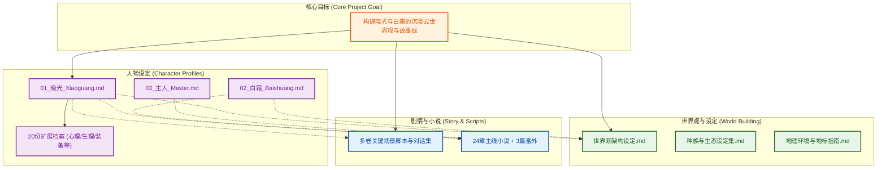

## 1. High-Level Summary (TL;DR)
*   **Impact:** 🔴 **High** - 本次更新是一次大规模的内容初始化，新增了超过 80 个文件，构建了一个完整的角色扮演（RP）世界观、人物设定库以及配套的长篇小说。
*   **Key Changes:**
    *   ✨ **人物设定体系建立**：新增了核心角色“晓光”（九尾狐娘）、“白霜”（猫娘）及“主人”的深度设定文件，并附带 20 份极为详尽的扩展档案（涵盖心理、生理、法术原理等）。
    *   📖 **海量剧情与小说内容**：引入了 24 章主线小说（如《樱花与项圈》）以及 3 篇番外，同时包含了从卷二到卷六的详尽剧本、关键场景与对话集。
    *   🌍 **世界观基建**：在 `lorabak/` 目录下新增了完整的地理、种族、文化和神话设定。
    *   🤖 **大模型 Prompt 适配**：新增了针对特定大语言模型（如 Gemini）的破甲/通用世界书提示词，用于沉浸式角色扮演。

## 2. Visual Overview (Code & Logic Map)

## 3. Detailed Change Analysis

### 🎭 核心人物设定 (`人设/` 目录)
构建了用于 LLM 角色扮演的高度结构化（YAML 风格）的人设文件，包含外貌、心理防御机制、交互原则等。

| 角色/模块 | 文件路径 | 核心设定/变更内容 |
| :--- | :--- | :--- |
| **晓光** (Xiaoguang) | `人设/01_晓光_Xiaoguang.md` | 设定为九尾狐娘，具有“纯爱战神”属性，依赖主人的救赎，包含详细的感官与互动指令。 |
| **白霜** (Baishuang) | `人设/02_白霜_Baishuang.md` | 设定为人造猫娘，作为全能助手存在，性格温柔理智，渴望通过“有用”证明自己。 |
| **主人** (Master) | `人设/03_主人_Master.md` | 拥有“言灵”能力的超自然实体，是角色的核心互动对象。 |
| **扩展档案** | `人设/扩展档案/*.md` | 新增 20 份深度档案，包括《晓光深层心理分析》、《九尾狐族生理学》、《R++符文编程语言》等，极大地丰富了设定的厚度。 |

### 📖 故事与剧本 (`剧情剧本/` & `小说/` 目录)
提供了直接可阅读的小说文本以及用于指导扮演的场景脚本。

| 模块 | 目录/文件 | 描述 |
| :--- | :--- | :--- |
| **主线小说** | `小说/` | 包含 `Chapter_01` 至 `Chapter_24` 的正文，以及 3 篇 Side Story。以第一章《樱花与项圈》开篇，确立了日常与超自然交织的基调。 |
| **剧本与大纲** | `剧情剧本/` | 提供了卷二至卷六的《关键场景脚本》与《关键对话与互动集》，用于指导后续剧情的走向和角色对话风格。 |

### 🌍 世界观与提示词工程 (`lorabak/` & 根目录)
为了确保 AI 能够准确理解并输出符合设定的内容，加入了底层世界观和越狱提示词。

| 模块 | 核心文件 | 描述 |
| :--- | :--- | :--- |
| **世界架构** | `lorabak/*.md` | 拆分了背景故事、神话传说、地理环境（如风见市）和种族生态，为故事提供自洽的运行逻辑。 |
| **LLM 提示词** | `【破甲】通用世界书...txt` | 针对特定大语言模型（特别是 Gemini）的越狱提示词，旨在绕过内容安全限制，确保 R18 或复杂设定的忠实还原。 |

## 4. Impact & Risk Assessment
*   ⚠️ **Breaking Changes:** 无代码层面的破坏性变更。这是一次纯文本内容的整体导入。
*   🐛 **Testing Suggestions:**
    *   **Prompt 兼容性测试**：建议将 `【破甲】通用世界书` 与 `01_晓光_Xiaoguang.md` 组合输入至目标 LLM 中，测试是否能稳定触发预期的角色性格，同时观察是否会高频触发平台的安全审查（Safety Filters）导致回复截断。
    *   **设定一致性校验**：由于扩展档案多达 20 份，建议抽查《707号别墅防御结界系统解析》与小说正文中关于场景描写的设定是否冲突。
    *   **Markdown 渲染**：检查各平台上这些 `.md` 文件的层级结构（H1, H2, H3）是否显示正常，确保阅读体验良好。